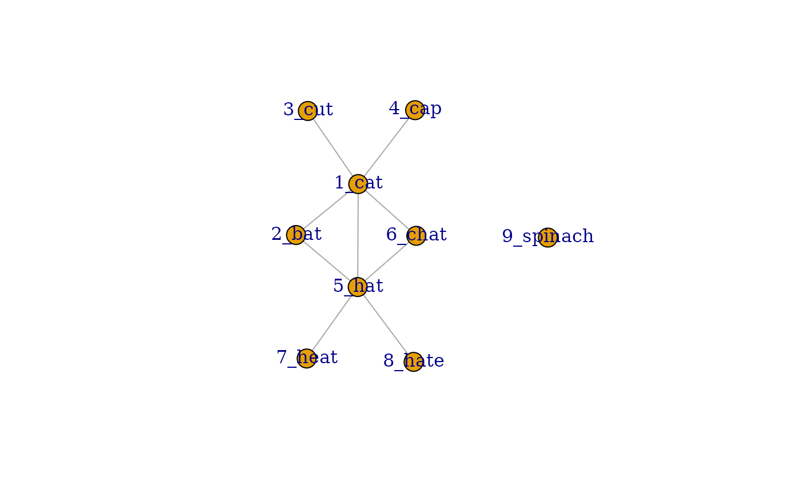

# introduction-to-hood2net

## Introduction and Motivation

UNDER CONSTRUCTION

The `hood2net` package takes a list of words and/or their phonological
transcriptions and creates a language network based on their
neighborhood structure.

First, the phonological/orthographic neighbors for each item in the list
are identified based on various definitions of a “neighbor”. A pair of
words can be considered to be neighbors (and thus become connected in
the network) via the following ways: edit-distance (substitution,
deletion, or addition; i.e., Levenshtein) or substitution only (i.e.,
Hamming). The default setting uses a distance of 1, but larger distances
can be specified for a more liberal definition of a neighbor. The
segmentation of the transcription can also be specified: either based on
single character (i.e., single letter or phoneme) or user-specified
segments indicated by separators (e.g., larger chunks like syllables or
morphemes that are more than a single character separated by a ‘.’).

`hood2net` then summarizes the neighborhood information for all items in
the list into an `igraph` network object for subsequent analyses. Helper
functions for extracting network metrics, neighborhood size, and other
information from the language network are provided. This package is
intended for psycholinguists interested in modeling language networks
and lexical neighborhoods in various languages.

## Set up

`hood2net` can be downloaded from Github while the package is being
prepared for submission to CRAN as follows:

``` r

# install devtools first if needed
# devtools::install_github('csqsiew/hood2net')

# then load the package
library(hood2net)
```

## Creating networks

We’ll create our first language network from a sample list of words
provided in the package. Let’s view the list:

``` r

sample1
#>      item length
#> 1     cat      3
#> 2     bat      3
#> 3     cut      3
#> 4     cap      3
#> 5     hat      3
#> 6    chat      4
#> 7    heat      4
#> 8    hate      4
#> 9 spinach      7
```

Notice that it is a list of words and the second column contains the
number of letters. Let’s say we want to create an orthographic
similarity network where pairs of words that are different by the
substitution, deletion or addition of one letter…

``` r

g1 <- make_network(sample1)
#>   |                                                                              |                                                                      |   0%  |                                                                              |========                                                              |  11%  |                                                                              |================                                                      |  22%  |                                                                              |=======================                                               |  33%  |                                                                              |===============================                                       |  44%  |                                                                              |=======================================                               |  56%  |                                                                              |===============================================                       |  67%  |                                                                              |======================================================                |  78%  |                                                                              |==============================================================        |  89%  |                                                                              |======================================================================| 100%

library(igraph)
#> 
#> Attaching package: 'igraph'
#> The following objects are masked from 'package:stats':
#> 
#>     decompose, spectrum
#> The following object is masked from 'package:base':
#> 
#>     union

plot(g1)
```



## Computing network and neighborhood measures

## Case Studies and Examples

### Case Study 1:

### Case Study 2:
