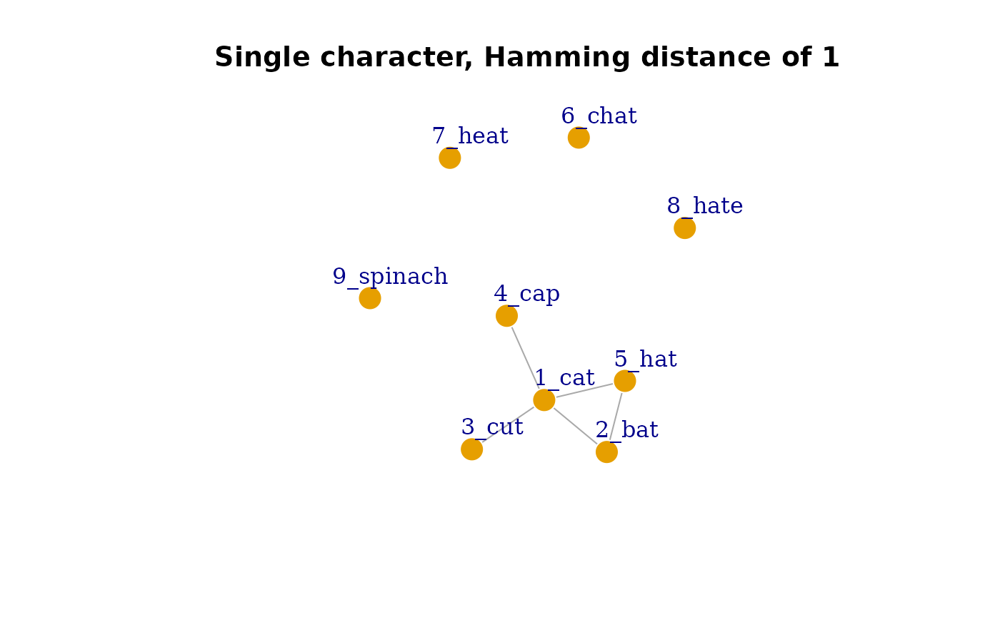
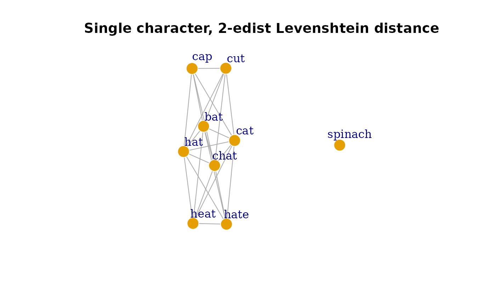
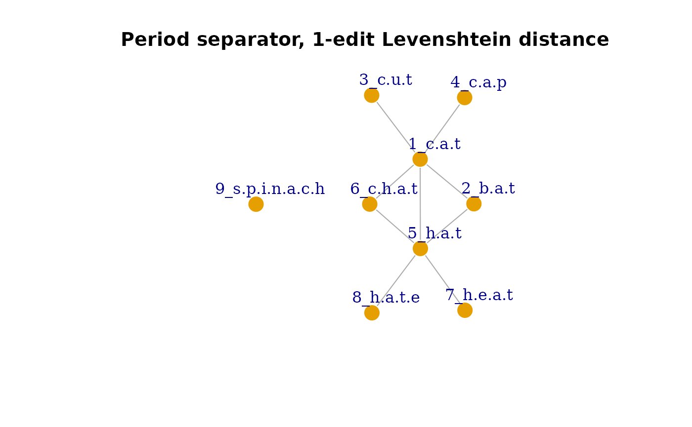

# A Quick Introduction to hood2net

## Introduction and Motivation

The `hood2net` package takes a list of words and/or their phonological
transcriptions and creates a language network based on their
phonological or orthographic neighborhood structure. This is where the
name of the package comes from: From a word’s neighborHOOD to a NETwork.

First, the phonological/orthographic neighbors for each item in the list
are identified based on various definitions of a “neighbor”. A pair of
words can be considered to be neighbors (and thus become connected in
the language network) via the following ways: edit-distance
(substitution, deletion, or addition; i.e., Levenshtein distance) or
substitution only (i.e., Hamming distance). The default setting uses a
distance of 1, but larger distances can be specified for a more liberal
definition of a neighbor. The segmentation of the transcription can also
be specified: either based on single character (i.e., single letter or
phoneme) or user-specified segments indicated by separators (e.g.,
larger chunks such as diphthongs, syllables, or morphemes that are
longer than a single character separated by a symbol like ‘.’ \[period\]
or ’ ’ \[space\]).

`hood2net` then summarizes the neighborhood information for all items in
the list into an `igraph` network object for subsequent analyses. Helper
functions for extracting network metrics, neighborhood size, and other
information from the language network are provided. This package is
intended for psycholinguists interested in modeling language networks
and lexical neighborhoods in various languages.

### Why `hood2net`?

Although there are several resources that exist for calculating the
neighborhoods or similarity measures of words in language, to the best
of my knowledge none of these existing resources provide capabilities to
convert the neighborhood structure of words into a network, which is
necessary for network analyses of such lexical information. Below are a
few examples and a brief statement of their purpose and function and how
it compares to `hood2net`:

*Jiwar* is a multilingual neighborhood calculator and database for 40
languages of various scripts (Alzahrani, 2025). It provides
phonological, orthographic, and phonographic neighborhood measures for
these languages based on the OpenSubtitles corpus. Although it is a
highly comprehensive database and neighborhood calculator, Jiwar does
not provide the functions to convert the neighborhood information into a
language network. The multilingual word lists and phonological
transcriptions from Jiwar could be provided to `hood2net` to produce
language networks and extract additional types of network metrics (e.g.,
closeness centrality or eigenvector centrality). It is also worth noting
that the vast majority of neighborhood calculators or databases are
limited to a single language; hence another strength of `hood2net` is
the ability to compute neighborhood measures for languages not yet
represented or unavailable in the literature.

Another database worth mentioning is by Alderete et al. (2025), who
created phonological similarity networks of English based on the
SUBTLEX-US English corpus. Although this database contains phonological
networks, it is limited to English. By allowing user-specified word
lists, `hood2net` allows for word similarity networks to be constructed
for a variety of languages, enabling network analyses to be extended to
languages beyond English.

## Set up

The development version of `hood2net` can be downloaded from Github
using the following code. In order to compile the package on your local
computer, additional programs may need to be installed. For instance,
Windows users will need to install
[RTools](https://cran.r-project.org/bin/windows/Rtools/), whereas Mac
users will probably need XCode.

``` r

# install.packages('devtools')
# devtools::install_github('csqsiew/hood2net')

# alternatively
# install.packages('pak')
# pak::pkg_install("csqsiew/hootnet")

# then load the package
library(hood2net)
```

Alternatively, `hood2net` can also be installed from CRAN as follows:

``` r

# install.packages('hood2net')

# then load the package
library(hood2net)
```

## Creating networks

We’ll create our first language network from a sample list of words
provided in the package. Let’s view the list:

``` r

sample1
#>      item length
#> 1     cat      3
#> 2     bat      3
#> 3     cut      3
#> 4     cap      3
#> 5     hat      3
#> 6    chat      4
#> 7    heat      4
#> 8    hate      4
#> 9 spinach      7
```

Notice that it is a list of words and the second column contains the
number of letters. Let’s say we want to create an orthographic
similarity network where pairs of words that are different by the
substitution, deletion or addition of one letter. We can run the
following R code as follows:

``` r

g1 <- make_network(sample1)
#>   |                                                                              |                                                                      |   0%  |                                                                              |========                                                              |  11%  |                                                                              |================                                                      |  22%  |                                                                              |=======================                                               |  33%  |                                                                              |===============================                                       |  44%  |                                                                              |=======================================                               |  56%  |                                                                              |===============================================                       |  67%  |                                                                              |======================================================                |  78%  |                                                                              |==============================================================        |  89%  |                                                                              |======================================================================| 100%

library(igraph)
#> 
#> Attaching package: 'igraph'
#> The following objects are masked from 'package:stats':
#> 
#>     decompose, spectrum
#> The following object is masked from 'package:base':
#> 
#>     union

plot(g1, vertex.frame.color = 'white', vertex.label.dist = 2.5,
     frame = TRUE, main = 'Single character, 1-edit Levenshtein distance')
```


Notice that the default settings of `make_network` is to segment each
item based on single characters, and to create neighbors based on 1-edit
(Levenshtein) distance.

If we would like to create substitution-only networks, we can easily do
this by changing the arguments in `make_network`:

``` r

g2 <- make_network(sample1, neighbor_type = 'hamming') # sub-only
#>   |                                                                              |                                                                      |   0%  |                                                                              |========                                                              |  11%  |                                                                              |================                                                      |  22%  |                                                                              |=======================                                               |  33%  |                                                                              |===============================                                       |  44%  |                                                                              |=======================================                               |  56%  |                                                                              |===============================================                       |  67%  |                                                                              |======================================================                |  78%  |                                                                              |==============================================================        |  89%  |                                                                              |======================================================================| 100%

plot(g2, vertex.frame.color = 'white', vertex.label.dist = 2.5,
     frame = TRUE, main = 'Single character, Hamming distance of 1')
```



For a more liberal operationalization of neighbors, we can also allow
pairs of words to be neighbors if they are different by up to 2-edit
distance, by adapting the code as follows:

``` r

g3 <- make_network(sample1, edit_size = 2)
#>   |                                                                              |                                                                      |   0%  |                                                                              |========                                                              |  11%  |                                                                              |================                                                      |  22%  |                                                                              |=======================                                               |  33%  |                                                                              |===============================                                       |  44%  |                                                                              |=======================================                               |  56%  |                                                                              |===============================================                       |  67%  |                                                                              |======================================================                |  78%  |                                                                              |==============================================================        |  89%  |                                                                              |======================================================================| 100%

plot(g3, vertex.frame.color = 'white', vertex.label.dist = 2.5,
     frame = TRUE, main = 'Single character, 2-edist Levenshtein distance')
```



Notice that in this network, the words ‘heat’ and ‘hate’ are connected
as a deletion and an addition (2 operations) are needed to convert from
one string into the other.

If you don’t want to use single characters as the segmentation scheme,
the `make_network_sep` function can be used instead and each item can be
segmented based on the separator symbol specified. In this sample list,
we have the same list of items as before, but with periods (.)
separating each letter. We can use the `make_network_sep` function to
create a network by segmenting the items based on the periods:

``` r

sample2
#>            item length
#> 1         c.a.t      3
#> 2         b.a.t      3
#> 3         c.u.t      3
#> 4         c.a.p      3
#> 5         h.a.t      3
#> 6       c.h.a.t      4
#> 7       h.e.a.t      4
#> 8       h.a.t.e      4
#> 9 s.p.i.n.a.c.h      7

g4 <- make_network_sep(sample2, separator = '.')
#>   |                                                                              |                                                                      |   0%  |                                                                              |========                                                              |  11%  |                                                                              |================                                                      |  22%  |                                                                              |=======================                                               |  33%  |                                                                              |===============================                                       |  44%  |                                                                              |=======================================                               |  56%  |                                                                              |===============================================                       |  67%  |                                                                              |======================================================                |  78%  |                                                                              |==============================================================        |  89%  |                                                                              |======================================================================| 100%

plot(g4, vertex.frame.color = 'white', vertex.label.dist = 2.5,
     frame = TRUE, main = 'Period separator, 1-edit Levenshtein distance')
```



This function may be useful for situations where you would like
subgroups of characters to be considered as a single unit, for instance,
if there are diphthongs (e.g., “\aɪ\\) or if you wish to explore
higher-order structures like syllabic structure. The default separator
symbol is the period, but other symbols like ’ ’ \[space\] are also
permitted. The other arguments mentioned, `edit_size` and
`neighbor_type`, are also applicable for the `make_network_sep`
function.

*Pro-tip*: You may want to save very large networks as they take a long
time to complete. This can be done easily and then you can reload the
file into your next R session.

``` r

# save
saveRDS(g1, file = 'my-network.RDS')

# load 
readRDS('my-network.RDS')
```

## Computing network and neighborhood measures

Once the language network is generated, it can be used to (i) obtain
global-level or macro-level information about the network structure, and
(ii) generate neighborhood-metrics for individual words.

### Obtaining macro-level network measures

The helper function `get_network_info` can be used to get this
information readily:

``` r

get_network_info(g1)
#>          nodes          edges           ASPL      global CC        mean CC 
#>          9.000          9.000          1.821          0.273          0.267 
#>       diameter    mean degree no. components   prop. in LCC 
#>          3.000          2.000          2.000          0.889
```

It returns in a named vector:

1.  `nodes`: The number of nodes.
2.  `edges`: The number of edges.
3.  `ASPL`: Average shortest path length refers to the mean of the
    shortest path between all possible node pairs (that have an
    non-infinite path).
4.  `global CC`: Global clustering coefficient or transitivity refers to
    the proportion of closed triangles in the network relative to the
    number of possible triangles. It is a measure of overall level of
    local connectivity among nodes in the network.
5.  `mean CC`: The average local clustering coefficient refers to the
    mean of each node’s local clustering coefficient, which measures the
    amount of interconnectivity in the local neighborhood of each node.
6.  `diameter`: Diameter refers to the length of the longest short path
    between node pairs in the network.
7.  `mean degree`: The average degree of all nodes in the network.
    Degree refers to the number of links (or neighbors) that each node
    has.
8.  `no. components`: The number of distinct, separate components in the
    network.
9.  `prop. in LCC`: The proportion of nodes found in the largest
    connected component of the network.

For more details about these measures and their application to language
or cognitive networks, please refer to <https://csqsiew.github.io> (an
online tutorial “Introduction to Network Analysis in `igraph`”) and Siew
et al. (2019).

If you wish to compute other network measures, you can simply pass the
network object into the relevant `igraph` function. Below we compute the
density of the network `g1`:

``` r

library(igraph)

edge_density(g1)
#> [1] 0.25
```

### Compute micro-level network measures for individual nodes

Another cool feature of `hood2net` is the ability to easily extract the
neighborhood information for all or subsets of nodes in the network.

To obtain neighborhood size, which corresponds to node degree:

``` r

get_neighbor_size(g1)
#>     1_cat     2_bat     3_cut     4_cap     5_hat    6_chat    7_heat    8_hate 
#>         5         2         1         1         5         2         1         1 
#> 9_spinach 
#>         0
```

To obtain local clustering coefficient, which is a measure of how
interconnected a node’s neighborhood is:

``` r

get_neighbor_clustering(g1)
#>     1_cat     2_bat     3_cut     4_cap     5_hat    6_chat    7_heat    8_hate 
#>       0.2       1.0       0.0       0.0       0.2       1.0       0.0       0.0 
#> 9_spinach 
#>       0.0
```

It is also possible to compute the mean of a node’s neighbors’ property.
Recall that in `sample1`, there was a second column depicting the length
of the word:

``` r

sample1
#>      item length
#> 1     cat      3
#> 2     bat      3
#> 3     cut      3
#> 4     cap      3
#> 5     hat      3
#> 6    chat      4
#> 7    heat      4
#> 8    hate      4
#> 9 spinach      7
```

In the constructed network, `length` is included as a node or vertex
attribute.

``` r

summary(g1)
#> IGRAPH 4a32cba UN-- 9 9 -- test
#> + attr: name (g/c), name (v/c), item (v/c), length (v/n)
```

This makes it possible to obtain the mean length of each node’s
neighbor, as follows:

``` r

get_neighbor_mean(g1, attribute = 'length')
#>     1_cat     2_bat     3_cut     4_cap     5_hat    6_chat    7_heat    8_hate 
#>       3.2       3.0       3.0       3.0       3.6       3.0       3.0       3.0 
#> 9_spinach 
#>       NaN
```

Notice that the name of the node attribute must be specified. A useful
application of this function is that lexical properties of words can be
appended to the list that was initially submitted to `make_network`, and
automatically embedded into the network as node attributes. If word
frequency were included, it would be possible use this function to
compute mean neighborhood frequency for all items in the network, and
also compute macro-level network information such as assortative mixing
by frequency (i.e., do high-frequency words tend to be connected to
other high-frequency words in the network?).

## References

Alderete, J., Mann, S., & Tupper, P. (2025). Open-access network
science: Investigating phonological similarity networks based on the
SUBTLEX-US lexicon. *Behavior Research Methods, 57*(3), 96.
<https://doi.org/10.3758/s13428-025-02610-9>

Alzahrani, A. (2025). Jiwar: A database and calculator for word
neighborhood measures in 40 languages. *Behavior Research Methods,
57*(3), 98. <https://doi.org/10.3758/s13428-025-02612-7>

Siew, C. S. Q., Wulff, D. U., Beckage, N. M., & Kenett, Y. N. (2019).
Cognitive Network Science: A Review of Research on Cognition through the
Lens of Network Representations, Processes, and Dynamics. *Complexity*,
e2108423. <https://doi.org/10.1155/2019/2108423>
